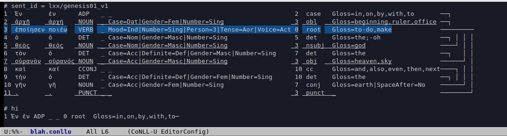

# `etsim-mode` עצים-mode
keyboard-only UD annotation in Emacs

- Displays tree structure
- Highlights parent of current word
- Underlines siblings

| Key binding | Action |
|-------------|--------|
| `b` | move to previous word |
| `d` | mark current word as dependent, creating arc if head is set |
| `f` | move to next word |
| `h` | mark current word as head, creating arc if dependent is set |
| `p` | move to parent of current word |
| `r` | set the current word as the root |
| `SPC` | change the relation label of the current word |
| `H [n]` | hide column `n`, `0` is column 10 |
| `S [n]` | show column `n`, `0` is column 10 |
